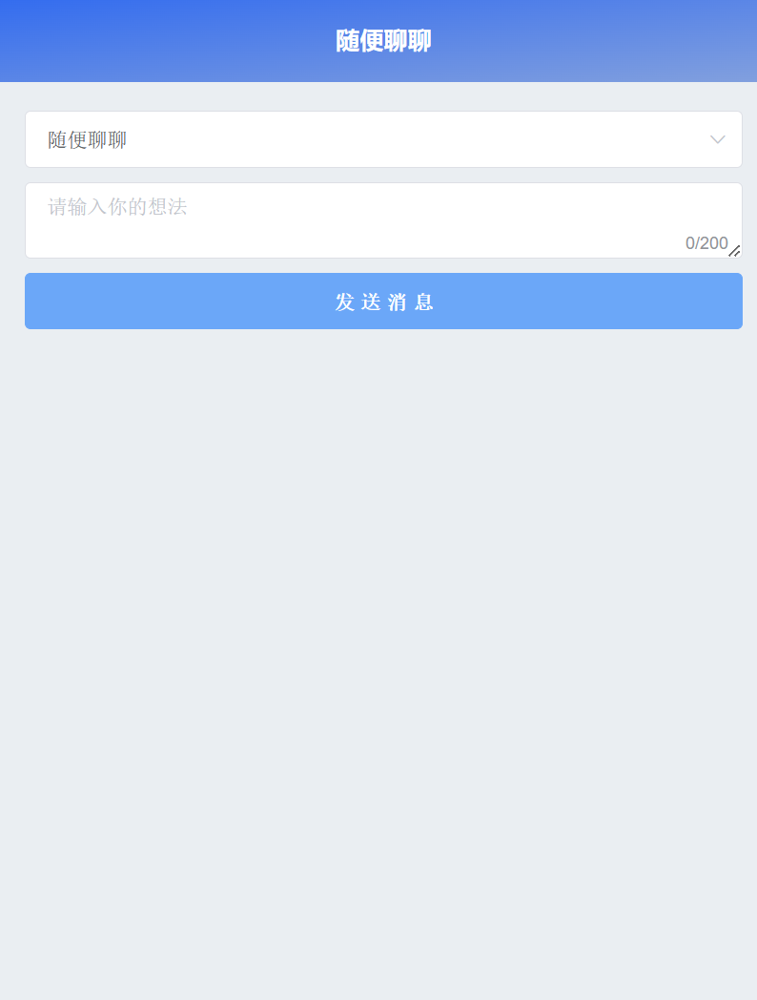

# wangcr-answer
use chartGPT create answer

本项目前提为已有ChartGPT账号



## 使用本项目

1.拉取代码

2.申请chatGPT的密钥

3.配置密钥到项目内

```shell
vim server-source/.env

OPENAI_API_KEY = 'sk-XXXXXXXXXXXX'
```


## 项目参考

- [使用 Python 和 ChatGPT API 开发一个智能聊天程序](https://lwebapp.com/zh/post/python-chatgpt-api)
- [ChatGPT 中文调教指南](https://github.com/PlexPt/awesome-chatgpt-prompts-zh)

### chatGPT

- [API 文档](https://platform.openai.com/docs/guides/chat/introduction)

- [生成chartGPT 密钥](https://platform.openai.com/account/api-keys)

